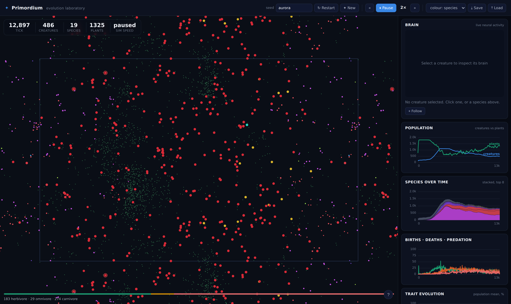
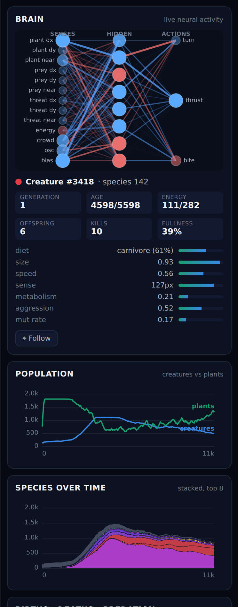
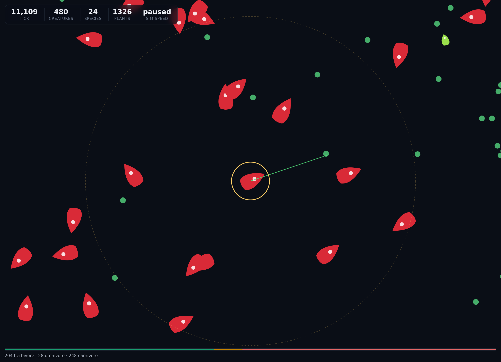
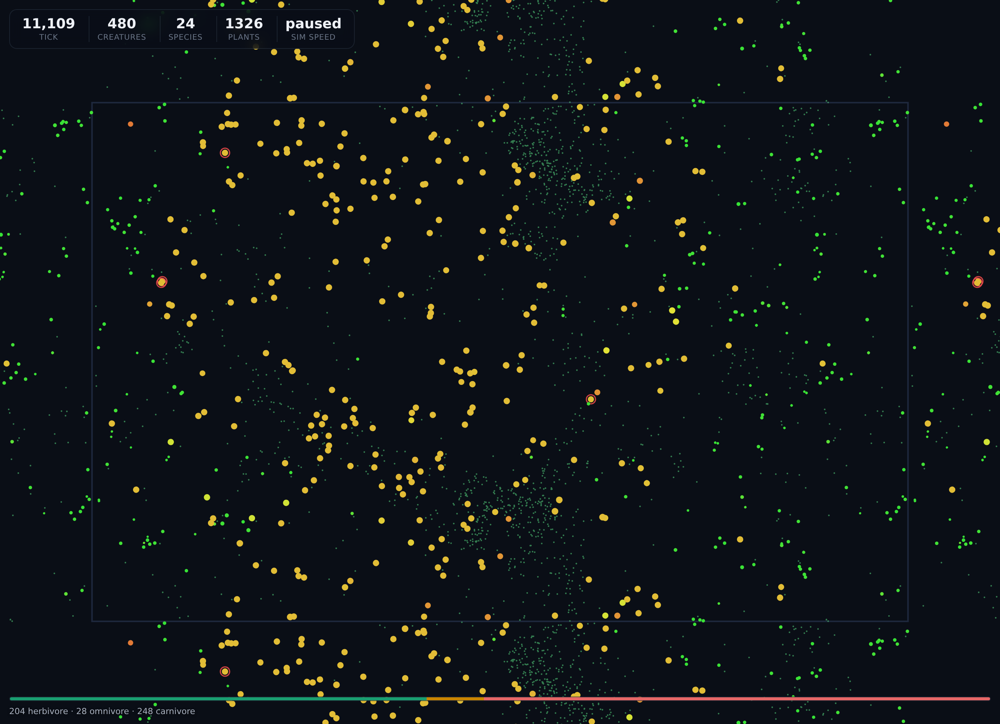

# Primordium — an artificial-life evolution laboratory

Primordium is a living ecosystem that runs entirely in your browser. Hundreds of
creatures — each with a **genetic code** and a tiny **neural-network brain** —
graze, hunt, flee, reproduce and mutate in a wrapping 2-D world. Nobody scripts
their behaviour. Predators, prey, camouflage-by-crowding, patrol gaits and the
split of one species into many are all **emergent**: they arise from selection
acting on random mutation, and you watch it happen live.

It is **zero-dependency vanilla JavaScript** — no framework, no build step, no
install. Open `index.html` and evolution starts. Every world is **deterministic
from its seed**, so a run is perfectly reproducible and shareable by URL.



---

## What you're looking at

| | |
|---|---|
| **The world** | Each shape is a creature; its body points the way it's heading and its snout sharpens the more carnivorous it is. Green dots are plants that grow in patchy meadows. The world is a torus — walk off one edge, arrive at the opposite one. Pan by dragging, zoom with the wheel, click a creature to select and follow it. |
| **The brain** | Click any creature to open its brain: a live neural network wired straight from its genome. Blue edges are excitatory, red inhibitory, thickness is weight; nodes light up with real activation each tick. Watch a `threat` sensor fire and drive the `thrust` output as it flees. |
| **The charts** | Population (creatures vs plants), a stacked history of every species, the flow of births / deaths / predation, and the population-mean of each heritable trait — all updating live, all with hover read-outs. |
| **Living species** | The current species ranked by population, each with its own colour and age. Click one to jump to a member. |



---

## The science, briefly

Primordium is a real (if small) model of **evolution by natural selection** with
a few deliberately honest mechanics:

- **Genome → phenotype.** Every creature carries a `Float64Array` genome: twelve
  named body/behaviour traits (size, speed, sense range, diet, metabolism,
  fertility, parental investment, longevity, aggression, colour, and two
  *meta-mutation* genes) followed by the weight vector of its brain. Traits are
  read once at birth into a body; there is no hidden scripting.

- **Brains, not rules.** A creature senses the nearest plant, the nearest thing
  it could eat, and the nearest thing that could eat *it* — each as a
  direction-and-proximity in its own local frame — plus its own energy, local
  crowding and a slow oscillator. A 13→8→3 `tanh` network turns those into
  *turn*, *thrust* and *bite*. The network's weights live in the genome, so
  **behaviour evolves**.

- **Meta-mutation.** How often and how hard a lineage mutates is itself encoded
  and heritable, so *evolvability* can evolve — lineages in turbulent times can
  ratchet up their own mutation rate.

- **Speciation with a real phylogeny.** A newborn stays in its parent's species
  until its genome drifts past a distance threshold; then it joins the nearest
  compatible species or founds a new one that records its parent species. The
  result is an actual family tree grown from mutation history, not a label.

- **An ecosystem that regulates itself.** Plants grow *logistically* (fast when
  the field is sparse, saturating at a carrying capacity), so grazing pressure
  drives genuine boom-and-bust cycles instead of a flat line. Predators can't eat
  their own kin, so they truly depend on a prey base and crash when they
  over-hunt it — the classic predator–prey oscillation. A trickle of immigration
  keeps the world from ever freezing into a monoculture.



### What emerges

Starting from a mostly-herbivorous soup seeded with a few hunters, a single run
typically shows: an early **herbivore bloom** that flattens the plant field, a
**predator boom** that crashes the grazers, a **predator die-off** as prey grows
scarce, then **recovery** — with the meta-traits, senses and gaits visibly tuned
by selection along the way. Colour the world *by diet* and the two guilds
separate before your eyes:



---

## Run it

No dependencies, no build.

```bash
# just open it
open primordium/index.html            # macOS
xdg-open primordium/index.html        # Linux

# …or serve it (needed if your browser blocks ES modules over file://)
cd primordium && npm run serve        # http://localhost:8123
# equivalently: python3 -m http.server 8123
```

Load a specific world with `?seed=aurora`. Any string is a valid seed.

### Controls

| Action | How |
|---|---|
| Pan / zoom | drag / mouse-wheel |
| Select & follow a creature | click it (click empty space to deselect) |
| Play / pause | `Space` or the toolbar |
| Faster / slower | `←` / `→` or `«` / `»` (0× → 64×) |
| Single step (while paused) | `.` |
| Toggle sense overlay | `s` |
| New random world / restart seed | toolbar |
| Colour by species / diet / energy | toolbar dropdown |
| Save / load a world | toolbar (downloads a JSON snapshot) |

Saved worlds resume **bit-identically** — the RNG state and every simulation
field are serialized losslessly.

---

## Tests

A dependency-free suite (custom runner, Node's `assert` only) covers the parts
that must be exactly right:

```bash
cd primordium && npm test
```

```
RNG              determinism, ranges, gaussian moments, save/load
Genome           bounds, meta-mutation, distance metric, drift
SpatialGrid      toroidal radius query vs brute force, wrap seams
Brain            topology, tanh bounds, purity, hand-wired signal
World            same-seed determinism (incl. split stepping), invariants,
                 energy/population accounting, speciation, immigration
Persistence      exact save/load round-trip and deterministic resume
```

All **43 tests** pass. Throughput (`npm run bench`) is several hundred ticks per
second at a steady-state population of many hundreds of creatures, each running
its own neural network every tick — comfortably enough for the 64× fast-forward.

---

## Project layout

```
primordium/
├── index.html              # app shell (single page)
├── css/style.css           # dark laboratory UI
├── js/
│   ├── core/rng.js         # seeded deterministic PRNG (mulberry32 + gaussian)
│   ├── engine/             # the simulation — no DOM, fully testable
│   │   ├── genome.js       #   genome layout, mutation, genetic distance
│   │   ├── brain.js        #   tiny feedforward network
│   │   ├── creature.js     #   genome → body → per-tick state
│   │   ├── spatial.js      #   toroidal spatial-hash grid
│   │   ├── species.js      #   incremental speciation + phylogeny
│   │   ├── history.js      #   decimating time-series recorder
│   │   └── world.js        #   the tick loop; owns everything
│   └── ui/                 # the browser front-end
│       ├── camera.js       #   pan / zoom / follow
│       ├── renderer.js     #   canvas world renderer
│       ├── inspector.js    #   live brain visualiser
│       ├── charts.js       #   line & stacked-area charts (validated palette)
│       └── app.js          #   controller: loop, panels, interaction
├── tests/                  # zero-dependency test suite + runner + bench
└── scripts/serve.js        # tiny static server
```

See [ARCHITECTURE.md](ARCHITECTURE.md) for the design in depth — the tick
pipeline, the determinism contract, the energy economy, and how each piece keeps
the simulation reproducible and fast.

---

## License

MIT.
